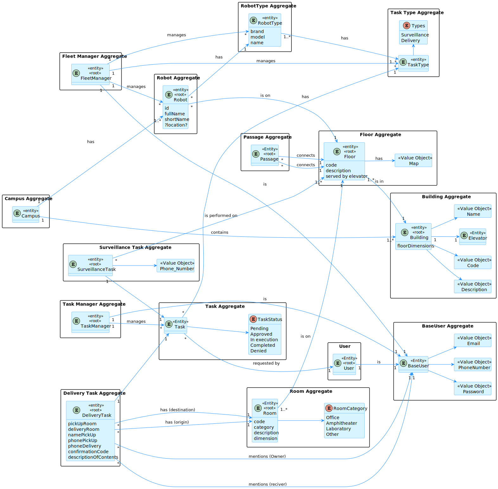
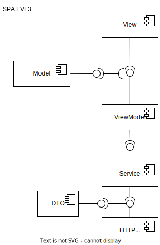
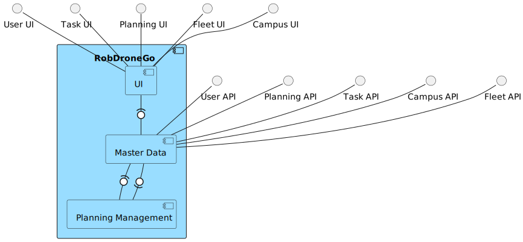

# About
A distributed, full-stack information system for virtual campus robot management. Developed iteratively using Agile Scrum and CI/CD practices. Built with Onion DDD architecture, it integrates advanced pathfinding algorithms and is deployed on a VM cluster with redundancy and load balancing within a virtual private network. The back-end is powered by Node.js (Express.js) and ASP\.NET, while the front-end leverages Angular with Three.js for 3D visualizations. Automated testing is implemented using Cypress, Jest, Mocha, and Postman. Prolog is used for web API logic and pathfinding algorithms. Project management and CI/CD pipelines were originally handled with Jira and Bitbucket.

# RobDroneGo Wiki

This is a wiki for the RobDroneGo project. It contains the following sections:

The Software Architecture Document (SAD) describes the software architecture of the system. It is intended to capture and convey the significant architectural decisions that have been made on the system (based on [Software+Architecture+Documentation+Template](https://wiki.sei.cmu.edu/confluence/display/SAD/Software+Architecture+Documentation+Template)):

* [Documentation Roadmap and Overview](docs/RoadmapOverview.md)
* [Architecture Background](docs/Background.md)
* [Views](docs/Views.md)
* [Mapping Between Views](docs/Mapping.md)
* [Referenced Materials](docs/References.md)
* [Glossary and Acronyms](docs/Gloassary&Acronyms.md)

The Scrum development process is described in the following sections:

* [DoR](docs/DoR.md) and [DoD](docs/DoD.md)
* [Daily Scrum Meetings](docs/Daily%20Scrum%20Meetings.md)
* [Backlog items](docs/Backlog%20Items.md)
* [Version Control Strategy](docs/Version%20Control%20Strategy.md)
* [Testing Strategy](docs/Testing%20Strategy.md)
* [Sprint A Retrospective](docs/Sprint%20A%20Retrospective.md)
* [Sprint B Retrospective](docs/Sprint%20B%20Retrospective.md)
* [Sprint C Retrospective](docs/Sprint%20C%20Retrospective.md)

Other documentation:

* [System Entity-Attribute Specification](docs/System%20Entity-Attribute%20Specification.md)
* [GDPR Report](docs/GDPR%20Report.md) 
* [Node API endpoints](docs/Node-API-endpoints.md)
# System Architecture Overview
The system architecture combines two representation models: C4 and 4+1.

The 4+1 View Model [[Krutchen-1995]](References.md#Kruchten-1995) describes the system through five complementary views addressing different stakeholder concerns:
- Logical: business functionality
- Process: system interactions and behavior
- Development: software organization
- Physical: deployment on hardware
- Scenario: business processes and actors

The C4 Model [[Brown-2020]](References.md#Brown-2020)[[C4-2020]](References.md#C4-2020) structures the system into four abstraction levels:
- System (Level 1): overall system context;
- Containers (Level 2): major deployable units;
- Components (Level 3): internal parts of containers
- Code (Level 4): implementation details (not covered here)

While C4 refines detail across abstraction levels, 4+1 provides multiple stakeholder perspectives. Combined, they enable a comprehensive, multi-view architectural representation.

The Unified Modeling Language (UML) [[UML-2020]](References.md#UML-2020) [[UMLDiagrams-2020]](References.md#UMLDiagrams-2020) is used.

## Business Concepts

## Domain Design

### Logical View Lv1

### Logical View Lv2

### Logical View Lv3

## Process Views

Proccess view is diagrams are described for each user story. Each user story is described in its own section.

* [ID80  - User approval](docs/US/ID-80/README.md)
* [ID150 - Create building](docs/US/ID-150/README.md)
* [ID160 - Edit building](docs/US/ID-160/README.md)
* [ID170 - List all buildings](docs/US/ID-170/README.md)
* [ID180 - List buildings with min and max floors](docs/US/ID-180/README.md)
* [ID190 - Create building floor](docs/US/ID-190/README.md)
* [ID200 - Edit building floor information](docs/US/ID-200/README.md)
* [ID210 - List all floors in a building](docs/US/ID-210/README.md)
* [ID220 - List building floors with passage to other buildings](docs/US/ID-220/README.md)
* [ID230 - Upload floor map](docs/US/ID-230/README.md)
* [ID240 - Create passage between buildings](docs/US/ID-240/README.md)
* [ID250 - Edit passage between buildings](docs/US/ID-250/README.md)
* [ID260 - List passages between 2 buildings](docs/US/ID-260/README.md)
* [ID270 - Create an elevator in a building](docs/US/ID-270/README.md)
* [ID280 - Edit elevator in building](docs/US/ID-280/README.md)
* [ID290 - List elevators in building](docs/US/ID-290/README.md)
* [ID300 - List building floors served by elevator](docs/US/ID-300/README.md)
* [ID310 - Create building floor room](docs/US/ID-310/README.md)
* [ID350 - Add new type of robot](docs/US/ID-350/README.md)
* [ID360 - Add new robot to the fleet](docs/US/ID-360/README.md)
* [ID370 - Inhibit a robot](docs/US/ID-370/README.md)
* [ID380 - Consult all robots in fleet](docs/US/ID-380/README.md)
* [ID390 - Search robots by designation or task](docs/US/ID-390/README.md)
* [ID460 - Create Task Request](docs/US/ID-460/README.md)
* [ID500 - Execution sequence of tasks](docs/US/ID-500/README.md)
* [ID1050 - As a Campus manager, I intend to create a Building indicating](docs/US/ID-1050/README.md)
* [ID1160 - As a Campus manager, I intend to list Building Floors served by Elevator](docs/US/ID-1160/README.md)

### Integration Process Views

* [ID710, ID730 - Campus and route data exchange between modules](docs/US/ID-710_ID-730/README.md)
* [ID720, ID740 - Task, robot data exchange between modules for planning task execution](docs/US/ID-720_ID-740/README.md)

### Deployment View

## Implementation Views

### Implementation View Lv2

### Implementation View Lv3 (MD)

### Implementation View Lv3 (SPA)

