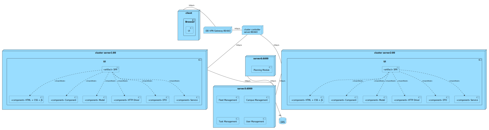

- [Mapping between Views](#mapping-between-views)
	- [Level 1](#level-1)
		- [Logical View - Implementation View](#logical-view---implementation-view)
		- [Implementation View - Physical View](#implementation-view---physical-view)
	- [Level 2](#level-2)
		- [Logical View - Implementation View](#logical-view---implementation-view-1)
		- [Implementation View - Physical View](#implementation-view---physical-view-1)
	- [Level 3 (BE)](#level-3-be)
		- [Logical View - Implementation View](#logical-view---implementation-view-2)
		- [Implementation View - Physical View](#implementation-view---physical-view-2)
	- [Level 3 (UI)](#level-3-ui)
		- [Logical View - Implementation View](#logical-view---implementation-view-3)
		- [Implementation View - Physical View](#implementation-view---physical-view-3)

# Mapping between Views

## Level 1
### Logical View - Implementation View

n/a

### Implementation View - Physical View

n/a

## Level 2
### Logical View - Implementation View 

### Implementation View - Physical View

<!--  -->

## Level 3 (MD)
### Logical View - Implementation View

### Implementation View - Physical View

## Level 3 (UI)
### Logical View - Implementation View

### Implementation View - Physical View

<!-- ## Level 3 (Planning)
### Logical View - Implementation View
TBD

### Implementation View - Physical View
TBD -->