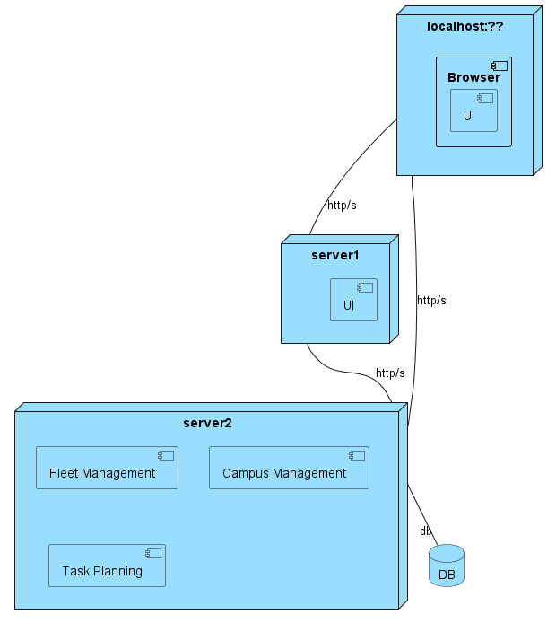

# ID210 - List all floors from one building

## Description
As user, I want to do a get request to the api to list all floors from one building

## Acceptance Criteria
* Get the information about all floors of one building. 
* Unit tests are written and passed.

## Questions from the forum

No questions were asked about this US

## Diagramns

### Logical View Lv1

### Logical View Lv2

### Logical View Lv3

.svg)
### Deployment View

### Process Diagram Lv1

### Process Diagram Lv2

### Process Diagram Lv3

### Domain Model

## Observations