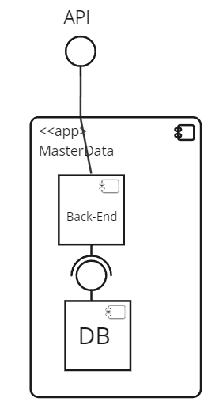

# ID 240 - Create passages between buildings

## Description
Create POST method for a passage between two buildings.

## Acceptance Criteria

* Passages can be created and stored in DB.
* Unit tests are written and passed.

## Questions from the forum

### Discussion - "US240 - Create Passage"
Creation date: 11/10/2023. [Go to discussion.](https://moodle.isep.ipp.pt/mod/forum/discuss.php?d=25082)

**Discussion summary:**
Each floor may feature multiple passageways to different buildings, and a single building can have several passages leading to another building, provided that these passages are located on separate floors.

## Diagrams

### Logical View Lv1

### Logical View Lv2

### Logical View Lv3

### Deployment View

### Process Diagram Lv1

### Process Diagram Lv2

### Process Diagram Lv3

### Domain Model

## Observations