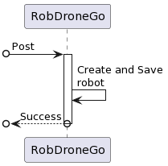
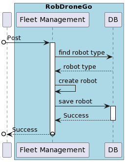
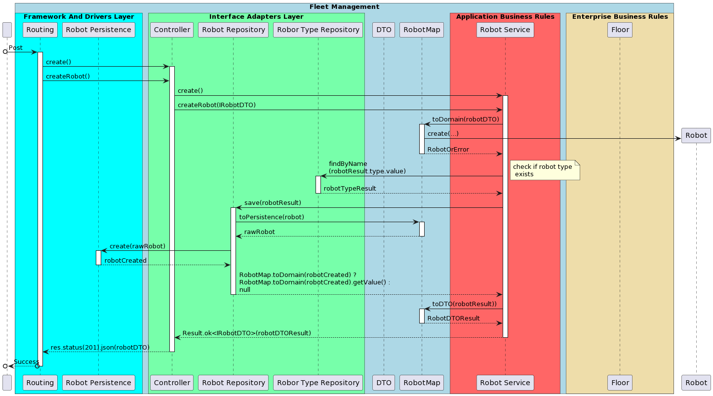

# ID 360 - Add a new robot

## Description
As Fleet Manager, I want to add a new robot to a fleet indicating its type, desingation, etc.

## Acceptance Criteria
* Robots can be created and stored in DB.
* Unit tests are written and passed.

## Questions from the forum

> Question:
> 
>Ao criar um novo robo, qual o estado dele por defeito, isto é, ativo ou inativo?
Tendo em conta a US370 seria ativo por defeito certo?
> 
> >Answer:
> >
>>Ao criar um robot ele fica no estado ativo
> 
> Question:
> 
> Os atributos do robot têm algum tipo de formatação/restrição?
> 
> >Answer:
> >
> > Código identificativo, obrigatório, alfanumerico, max 30 caracteres, único no sistema
> >
>>nickname, obrigatório, obrigatório, alfanumerico, max 30 caracteres, único no sistema
> >
>>tipo de robot, obrigatório
> >
>>número de série, obrigatório, alfanumerico, max 50 caracteres, único para um dado tipo de robot
> >
>>descrição, opcional, alfanumerico, max. 250 caracteres
> 
> Question:
> 
> 
## Diagramns

### Logical View Lv1

### Logical View Lv2

### Logical View Lv3

### Deployment View

### Process Diagram Lv1

### Process Diagram Lv2

### Process Diagram Lv3

### Domain Model

## Observations