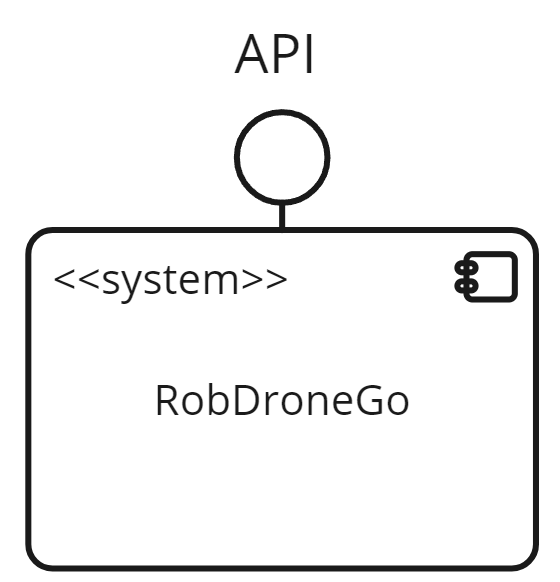
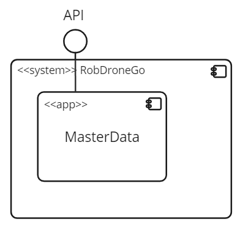
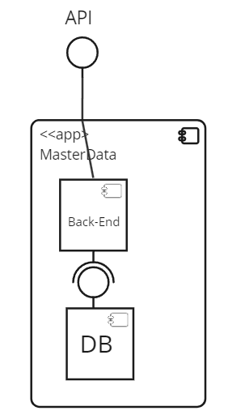
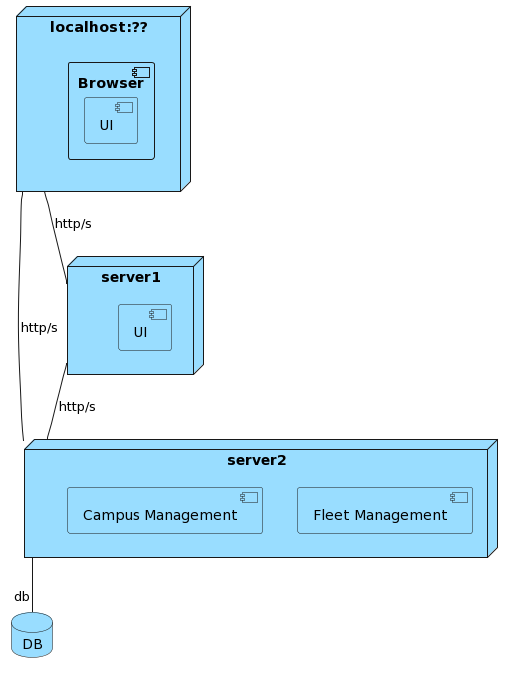
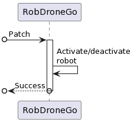
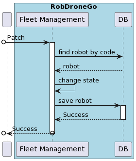
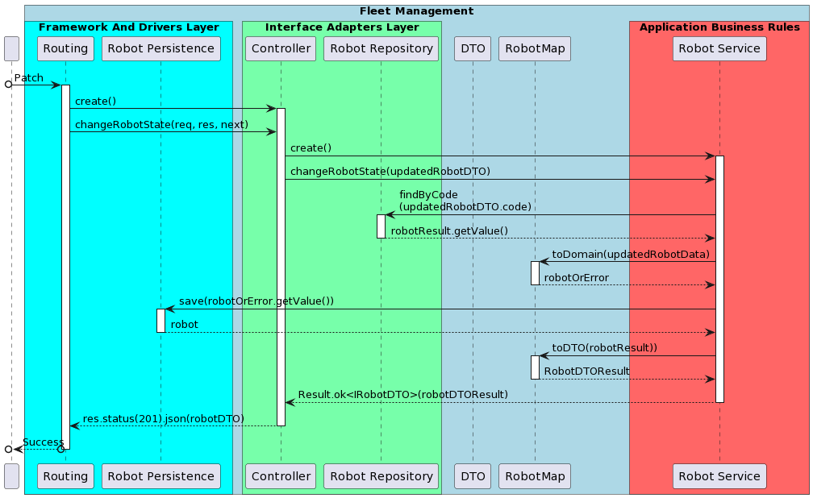
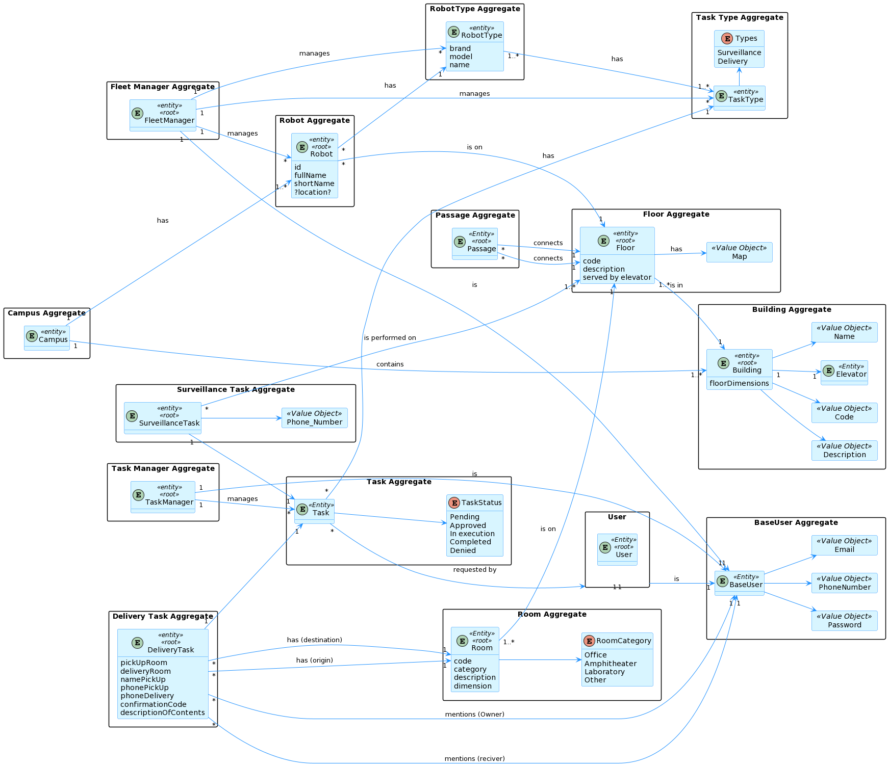

# ID 370 - Deactivate a robot

## Description
As a fleet manager I want to deactivate a robot

## Acceptance Criteria
* Robots can be turned to non-active state.
* Unit tests written and passed.

## Questions from the forum

> Question:
> 
>Ao criar um novo robo, qual o estado dele por defeito, isto é, ativo ou inativo?
Tendo em conta a US370 seria ativo por defeito certo?
>
> > Answer:
> >
> >Ao criar um robo ele fica no estado ativo
> 
> Question:
> 
> Há a possibilidade de inibir um robo. No entanto, para além deste "estado" que outros 
> estados pretende que existam? em funcionamento, ocupado, livre, a executar tarefa? Ou 
> basta apenas inibido - desinibido?
> 
> > Answer:
> >
> > Funcionalmente não existe esse conceito de "estado" que referes. poderá ser no entanto 
> >algo util em termos técnicos. De um ponto de vista funcional pretende-se que seja possivel 
> >inibir ou desinibir um robot e que essa informação seja devidamente utilizada nos restantes 
> >casos de uso. por exemplo, um robot inibido não pode executar tarefas.
> 
## Diagramns

### Logical View Lv1

### Logical View Lv2

### Logical View Lv3

### Deployment View

### Process Diagram Lv1

### Process Diagram Lv2

### Process Diagram Lv3

### Domain Model

## Observations