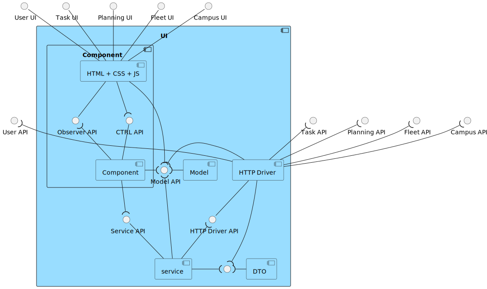

# ID460 As a user of the system, I intend to request a task indicating the parameters necessary for its execution, namely the starting and ending points and the desired task.

## Description
This requirement relates to the request for a task, this task must indicate the type of task to be performed.

## Acceptance Criteria
* Should be possible to request a task for a user.
* Approved & merged into develop branch through a PR.

## Questions from the forum
* Moodle post: [US460 - Request task](https://moodle.isep.ipp.pt/mod/forum/discuss.php?d=26358)
Summary:
The user can enter a contact other than their own. For example, teacher ABC requests the collection of a pen from the department office indicating the contact number of XYZ for delivery to classroom XXX to teacher ASD.
When requesting a task, you will need to indicate a pickup contact and a delivery contact (name and telephone number).

## Diagrams

### Logical View Lv1

### Logical View Lv2

### Logical View Lv3 (Task Management)

### Logical View Lv3 (SPA)

### Process Diagram Lv1

### Process Diagram Lv2

### Process Diagram Lv3

### Implementation View Lv2

### Implementation View Lv3 (MD)

### Implementation View Lv3 (UI)

### Deployment View

### Domain Model
