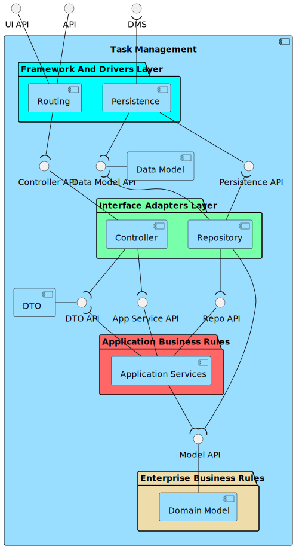

# ID470 As a task manager, I want to approve or reject a request

## Description
This requirement relates to the aprrove or reject of on task request

## Acceptance Criteria
* Task manager role user can see a list of requests and individually approve/reject them.
* Approved & merged into develop branch through a PR.

## Questions from the forum
* Moodle post: [US470 / US480 / US490](https://moodle.isep.ipp.pt/mod/forum/discuss.php?d=26717)
Summary:
There are two different options. One just to approve or reject tasks pending decision. The other option is to consult all system tasks, including history.

## Diagrams

### Logical View Lv1

### Logical View Lv2

### Logical View Lv3 (Task Management)

### Logical View Lv3 (SPA)

### Process Diagram Lv1

### Process Diagram Lv2

### Process Diagram Lv3

### Implementation View Lv2

### Implementation View Lv3 (MD)

### Implementation View Lv3 (UI)

### Deployment View

### Deployment View

### Domain Model

