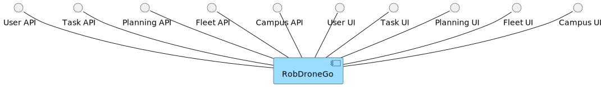
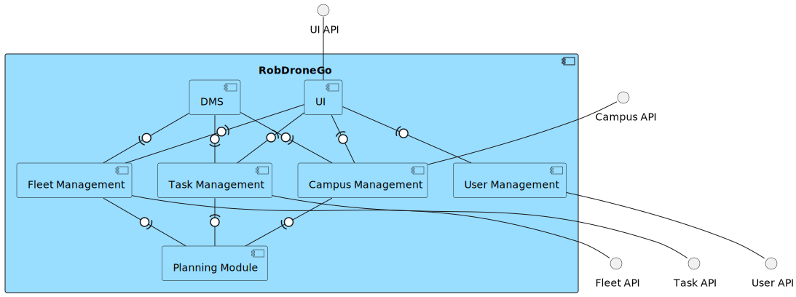
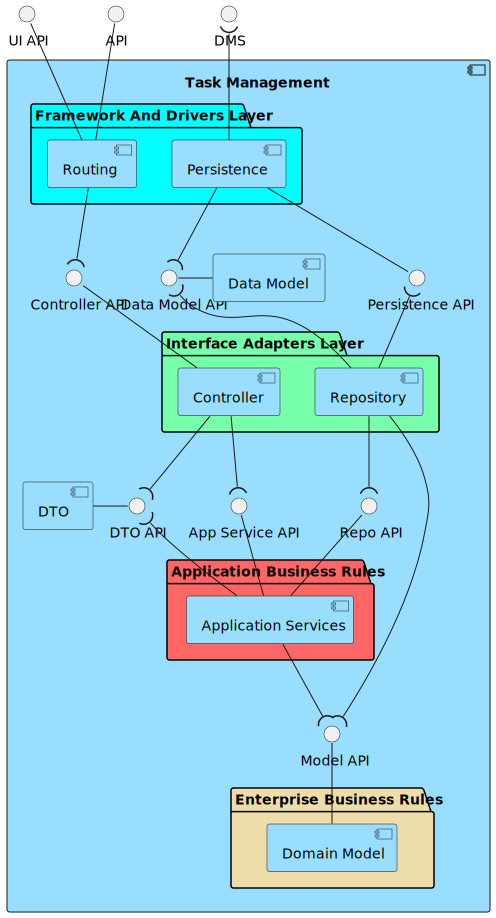
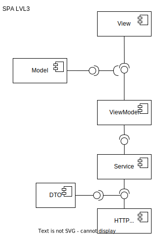
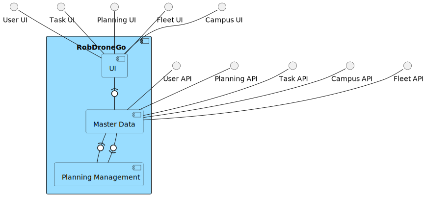
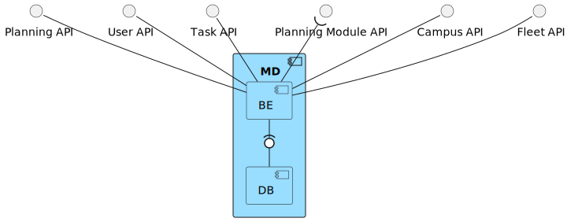
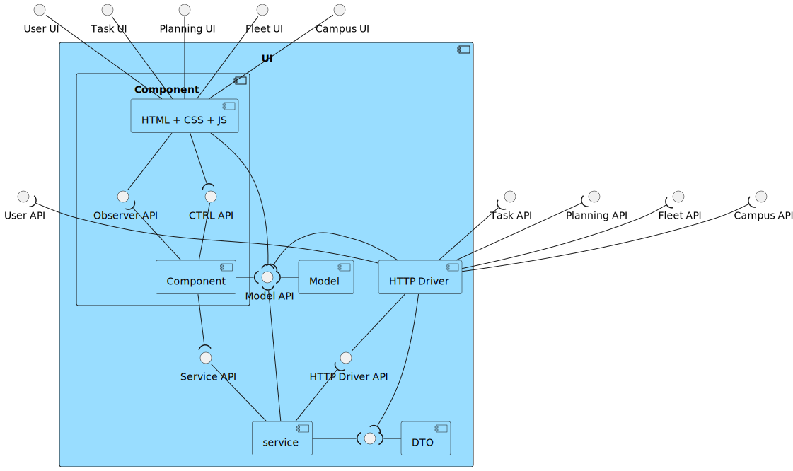
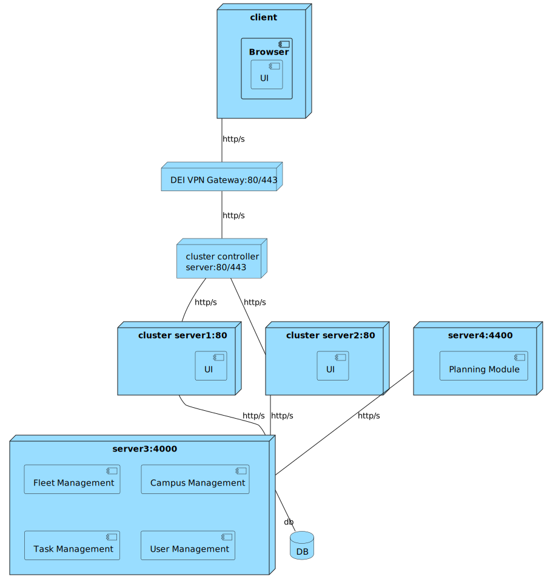

# ID480 As a task manager, I intend to consult task requests that have not yet been approved.

## Description
This requirement relates to the listing all tasks that are pending.

## Acceptance Criteria
* Task manager can see a list of pending requests.
* Approved & merged into develop branch through a PR.

## Questions from the forum
* Moodle post: [US480 | US490 - Consultar tarefas](https://moodle.isep.ipp.pt/mod/forum/discuss.php?d=26765)
Summary:
The customer, who is a task manager, wants to see the list of task requests that are not yet approved, and to search them by status, device type, or user. He also wants to see the identification code and the email of the requester for each task.
* Moodle post: [US460/480 - Requisitar tarefa](https://moodle.isep.ipp.pt/mod/forum/discuss.php?d=26799)
Summary:
The customer, who is a user, wants to request a task for a device, specifying the device type, the problem description, and the urgency level. He also wants to see the confirmation of his request and the identification code of the task.
* Moodle post: [480](https://moodle.isep.ipp.pt/mod/forum/discuss.php?d=26576)
Summary:
This is a requirement for the integrated project that asks the user to see the requests that have not been approved yet, meaning they have not received any decision: approval/refusal.

## Diagrams

### Logical View Lv1

### Logical View Lv2

### Logical View Lv3 (Task Management)

### Logical View Lv3 (SPA)

### Process Diagram Lv1

### Process Diagram Lv2

### Process Diagram Lv3

### Implementation View Lv2

### Implementation View Lv3 (MD)

### Implementation View Lv3 (UI)

### Deployment View

### Deployment View

### Domain Model

