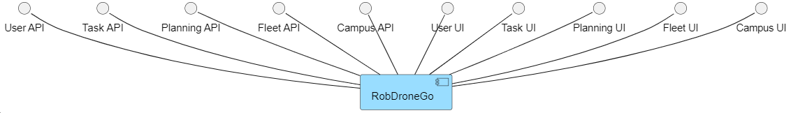

# ID490 As a task manager, I want to search task requests by status, device type, or user.

## Description
Form including status, devicetype and user, and search button to list request based on some of those demands. (Search robot very similar). 

type of device = type of robot

## Acceptance Criteria
* Task manager enter needed search data and search (see a list) of appropriate requests
* Approved & merged into develop branch through a PR.

## Questions from the forum
* Moodle post: [US490](https://moodle.isep.ipp.pt/mod/forum/discuss.php?d=26552)

Summary:
In the resulting list it must be possible to filter the data by the indicated attributes. This option shows all requests in the system, including those from past dates, so it should also be possible to filter by request date.

Please note that the volume of data can be very large, so you must technically assess how to balance this functional requirement with its technical implementation. For example, after some time the system may have thousands (or tens of thousands) of requests. Although it is acceptable for prototyping purposes that there are limitations in your implementation, such limitations must be duly and explicitly documented as well as proposed alternatives to overcome these limitations.

* Moodle post: [ID490](https://moodle.isep.ipp.pt/mod/forum/discuss.php?d=26583)

Summary: 
Tasks are requested by users and approved by the task manager. the task manager will also trigger the planning module which will take the list of approved requests and generate the execution plan. The execution plan takes into account the robot fleet and as such the output of the planning module will be result in the assignment of task(s) to robot(s) in a sequence that minimizes the overall execution time

## Diagrams

### Logical View Lv1

### Logical View Lv2

### Logical View Lv3

### Deployment View

### Process Diagram Lv1

### Process Diagram Lv2

### Process Diagram Lv3

### Domain Model
