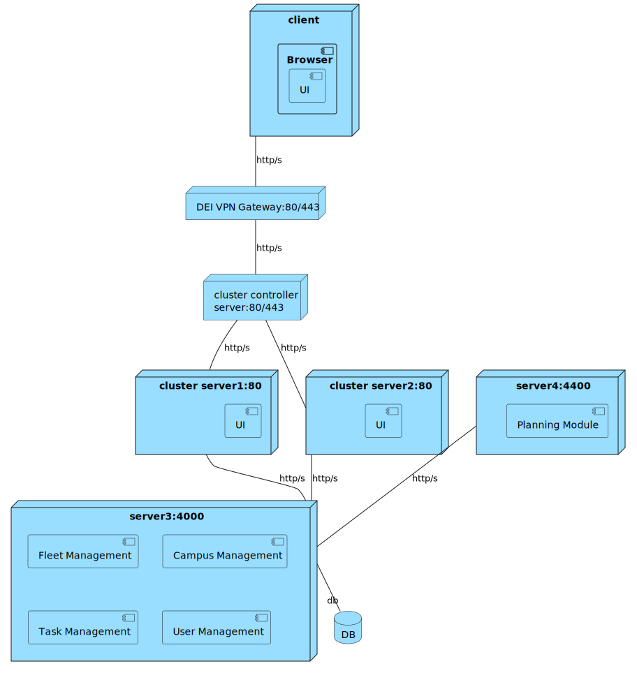
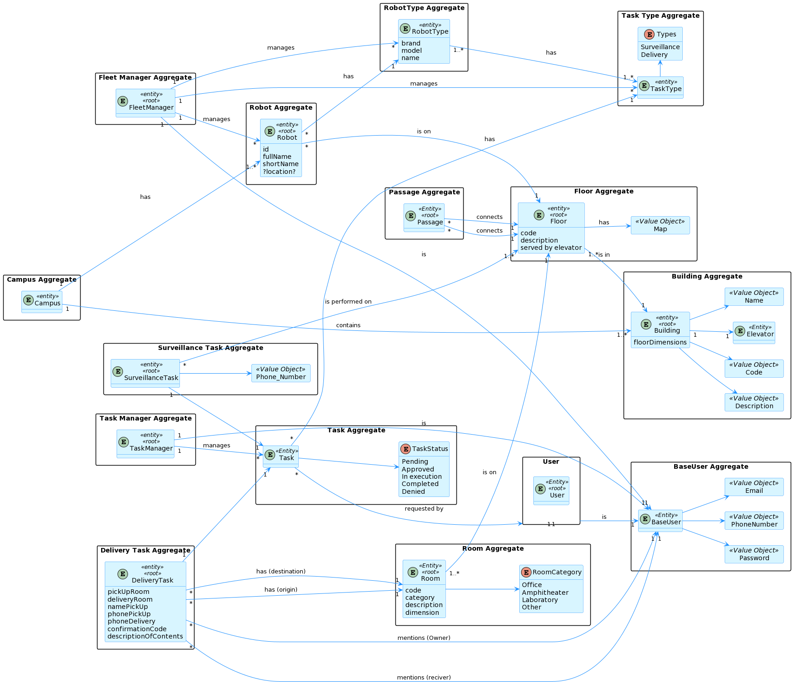

# ID500 As a task manager, I want to obtain the execution sequence of approved tasks.

## Description
Task manager should be able to start task planning and obtain the execution sequence of approved tasks.

## Acceptance Criteria
* Should be possible to request a task for a user.
* Approved & merged into develop branch through a PR.

## Questions from the forum
* Moodle post: [US500/1410/1430 - task execution planning](https://moodle.isep.ipp.pt/mod/forum/discuss.php?d=26437)
Summary:
According to what is stated in requirement 1410: "seja gerado um plano de atendimento das tarefas indicadas que indique uma sequência de execução das tarefas que seja criada através da geração de todas as sequências e escolha da que durar menos tempo.", that is, the sequence that takes the least amount of time to execute.
You can consider average times to calculate the duration of a request execution, for instance:
Move from one cell to another cell
traverse a passage from one building to another
use the elevator from one floor to an adjacent one
pickup an object
deliver an object
for simplicity you might assume a standard time for:
pickup and delivery in the same building/floor
pickup and delivery in the same building, different floor
pickup and delivery in different buildings
surveillance of a floor
all assumptions and simplifications must be properly identified, justified and explained.
There are currently no priority request. all request of the same type should be considered with equal priorit

* Moodle post: [US500](https://moodle.isep.ipp.pt/mod/forum/discuss.php?d=26639)
The planning module is the system module responsible for the functionalities of (i) calculating routes between points, and (ii) calculating the best organization for the robots to perform the approved tasks.

## Diagrams

### Logical View Lv1

### Logical View Lv2

### Logical View Lv3 (Task Management)

### Logical View Lv3 (SPA)

### Process Diagram Lv1

### Process Diagram Lv2

### Process Diagram Lv3

### Implementation View Lv2

### Implementation View Lv3 (MD)

### Implementation View Lv3 (UI)

### Deployment View

### Domain Model
