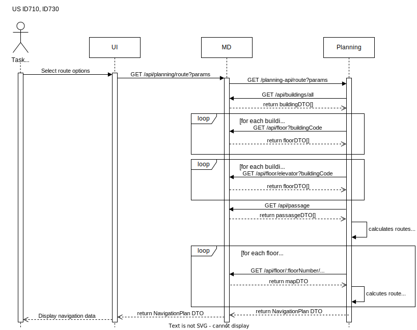

# ID710, ID730 - Campus and route data exchange between modules

## Diagrams
### Process View


## Data Models
### buildingDTO
```javascript
interface IBuildingDTO {
  id: string;
  name: string | null;
  code: string;
  description: string;
  floorSizeLength: number;
  floorSizeWidth: number;
  elevator?: {
    id: string;
    number: number;
    make?: string;
    model?: string;
    serialNumber?: string;
    description?: string;
  };
}
```

### floorDTO
```javascript
interface IFloorDTO {
  id: string;
  floorNumber: number;
  description: string | null;
  servedByElevator?: boolean;
  buildingCode: string;
  map?: {
    size: {
      width: number;
      height: number;
    };
    map: number[][];
    exitLocations?: {
      passages: { cellPosition: [number, number]; destination: { buildingCode: string; floorNumber: number } }[];
      elevators: { cellPosition: [number, number] }[];
    };
  };
}
```

### passageDTO
```javascript
interface IPassageDTO {
  id: string;
  buildingCode1: string;
  buildingCode2: string;
  floorNumber1: number;
  floorNumber2: number;
}
```

### mapDTO
```javascript
interface IMapDTO {
  size: {
    width: number;
    height: number;
  };
  map: number[][];
}
```

### NavigationPlan DTO
```javascript
interface NavigationPlan {
  floorsConnectionsCost: number;
  floorsPaths: FloorPath[];
  mapPathCount: number;
  mapPaths: MapPath[];
}

interface FloorPath {
  fromBuilding: string;
  fromFloorNumber: string;
  toBuilding: string;
  toFloorNumber: string;
  type: string;
}

interface MapPath {
  buildingCode: string;
  cost: number;
  floorNumber: number;
  path: PathPoint[];
}

interface PathPoint {
  col: number;
  row: number;
}
```

### GET Route query params
```javascript
query: Joi.object().keys({
    origin_building_code: Joi.string().required(),
    origin_floor_number: Joi.number().required(),
    origin_map_cell_x: Joi.number().required(),
    origin_map_cell_y: Joi.number().required(),
    destination_building_code: Joi.string().required(),
    destination_floor_number: Joi.number().required(),
    destination_map_cell_x: Joi.number().required(),
    destination_map_cell_y: Joi.number().required(),
    minimize_elevator_uses: Joi.boolean().required(),
    minimize_building_count: Joi.boolean().required(),
  })
```