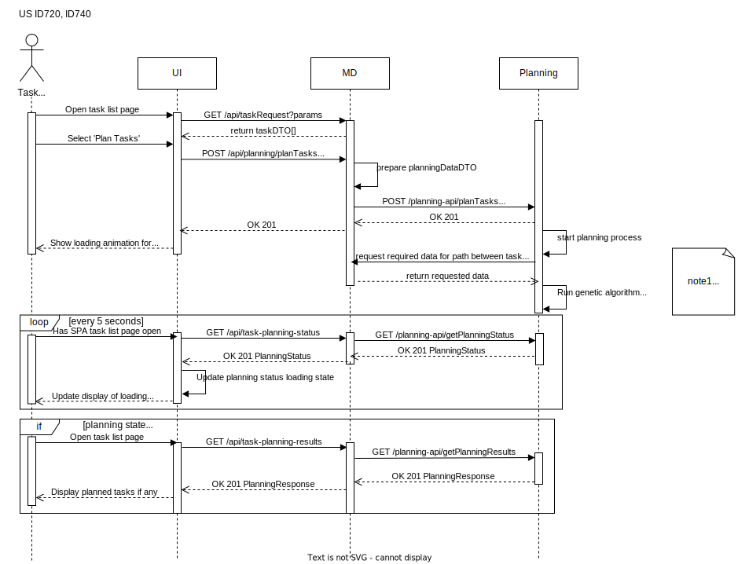

# ID720, ID740 - Task, robot data exchange between modules for planning task execution

## Diagrams
### Process View


## Data Models
### taskDTO
As JSON object.
```javascript
interface TaskRequest {
  id: string;
  status: TaskStatus;
  requesterEmail: string;
  task: DeliveryTask | SurveillanceTask;
  requestCreatedDateTime: string;
  navigationData?: NavigationPlan;
}
```

### Planning Data DTO
As Prolog facts file.
```prolog
task(robotId, taskId, origin(buildingCode, floorNumber, cel(col, row)), destination(buildingCode, floorNumber, cel(col, row)), taskType).
....
robot(robotId, origin).
....
-------------End of file--------------------------

Example: 
task('some-robot-id', 'taskid-2323-3231as3232221sd1', origin('A', 1, cel(2, 3)), destination('A', 1, cel(2, 3)), 'Surveillance').
robot('some-robot-id', origin('C', 2, cel(5, 5))).
```

### PlanningStatus DTO
As JSON object.
```javascript
interface TaskPlanningStatus {
  message: string;
  state: 'unstarted' | 'planning' | 'planned' | 'error';
}
```

### PlanningResponse DTO
As JSON object.
```javascript
type PlanningResponse = TaskPlan | PlanningError;

interface TaskPlan {
  data: TaskPlanData[];
}

interface TaskPlanData {
  costOfChange: number;
  robotId: string;
  status: string;
  tasks: string;
  type: 'taskPlan';
}

interface PlanningError {
  error: string;
}
```


### GET Route filtering query params
```javascript
type TaskFilters = {
  status?: TaskStatus;
  robotTypeName?: string;
  userEmail?: string;
};
```