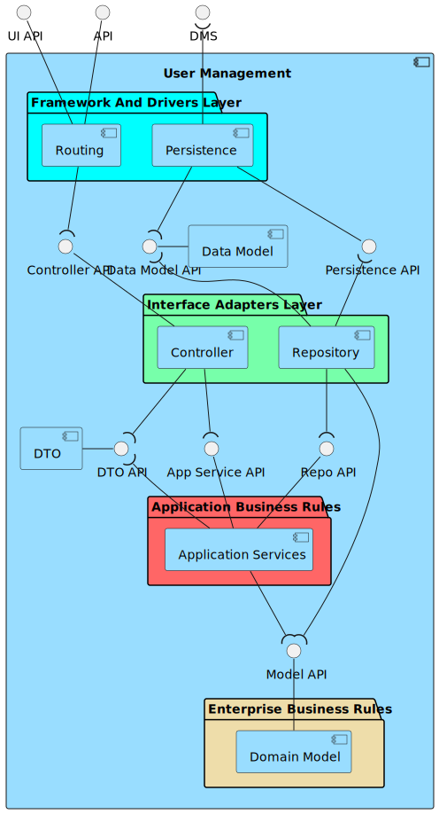

# ID80 - As a system administrator, I want to approve or reject a user's registration

## Description
When seeing a list of users, system admin should be able to select whether user is approved or not (isConfirmed property). Optionally, there could be a checkbox that when ticked should show only the non-confirmed users.

## Acceptance Criteria
* System admin can select whether user is confirmed or not in the list of users.
* Approved & merged into develop branch through a PR.

## Questions from the forum
* Moodle post: [ID10 - ID80](https://moodle.isep.ipp.pt/mod/forum/discuss.php?d=26380)
Summary:
User registration is for the students/employees of the university to use the system as a "user".
User creation is for the administrator to create new backoffice users, e.g., campus manager, fleet manager.

## Diagrams

### Logical View Lv1

### Logical View Lv2

### Logical View Lv3 (User Management)

### Logical View Lv3 (SPA)

### Process Diagram Lv1

### Process Diagram Lv2

### Process Diagram Lv3

### Implementation View Lv2

### Implementation View Lv3 (MD)

### Implementation View Lv3 (UI)

### Deployment View

### Domain Model

