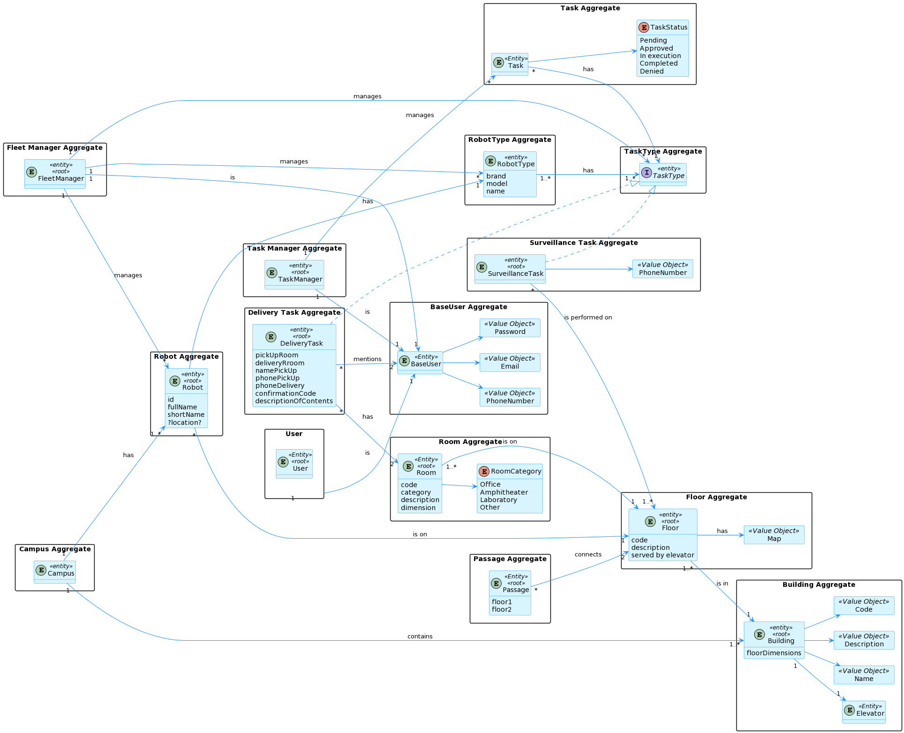

# ID 170 - List all buildings - ID 1060

## Description
As user, I want to do a get request to the api to list buildings that exist
in the system.

## Acceptance Criteria
* Get the information about all buildings.
* Unit tests are written and passed.

## Questions from the forum

No questions about this US were asked on forum

## Diagramns

### Logical View Lv2

### Logical View Lv3

### Deployment View

### Process Diagram Lv1

### Process Diagram Lv2

### Process Diagram Lv3

### Domain Model

## Observations