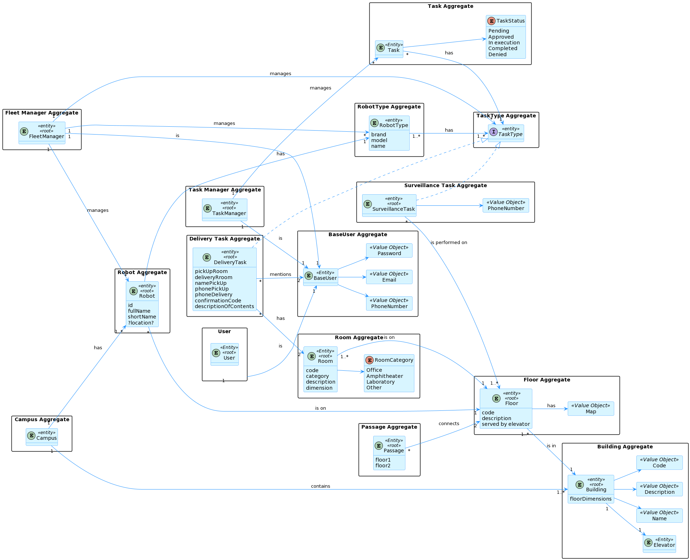

# ID 190 - Create a floor in a building ID 1090

## Description
As user, I want to do a post request to the api to create a floor of a building

## Acceptance Criteria
* Floors can be created and stored in DB.

* Unit tests are written and passed.
## Questions from the forum

> Question:
> 
>   Boa tarde, caro cliente.
É esperado que seja imposto um limite aquando da criação de um piso? Ex: 0 <= andar piso <= 100, De forma a evitar valores irrealistas.
Relativamente à breve descrição, referida em: https://moodle.isep.ipp.pt/mod/forum/discuss.php?d=25016, existirá alguma restrição quanto ao comprimento da mesma, como é o caso da descrição do edifício?
> 
> > Answer:
> >
> >não existem limites. podem existir pisos subteraneos, ex., piso -1.
a breve descrição é opcional e no máximo terá 250 caracteres
> 
> Question:
> 
> Será possível esclarecer como funcionarão estas user stories? Com a 230 (Carregar mapa do piso) o nosso entendimento foi que as células seriam carregadas já com a criação de salas e pisos, e assim sendo não faria sentido as outras duas user stories, onde é pedido para criar um piso de um edifício e uma sala. Não entendemos o que é pretendido  com as us's 190 e 310.
> 
> > Answer:
> >
> >o requisito 190 Criar piso permite definir um piso para um dos edificios criados anteriormente, por exemplo, o piso 1 do edificio B com uma breve descrição (ex., "salas TP")
>

## Diagramns

### Logical View Lv2

### Logical View Lv3

### Deployment View

### Process Diagram Lv1

### Process Diagram Lv2

### Process Diagram Lv3

### Domain Model

## Observations