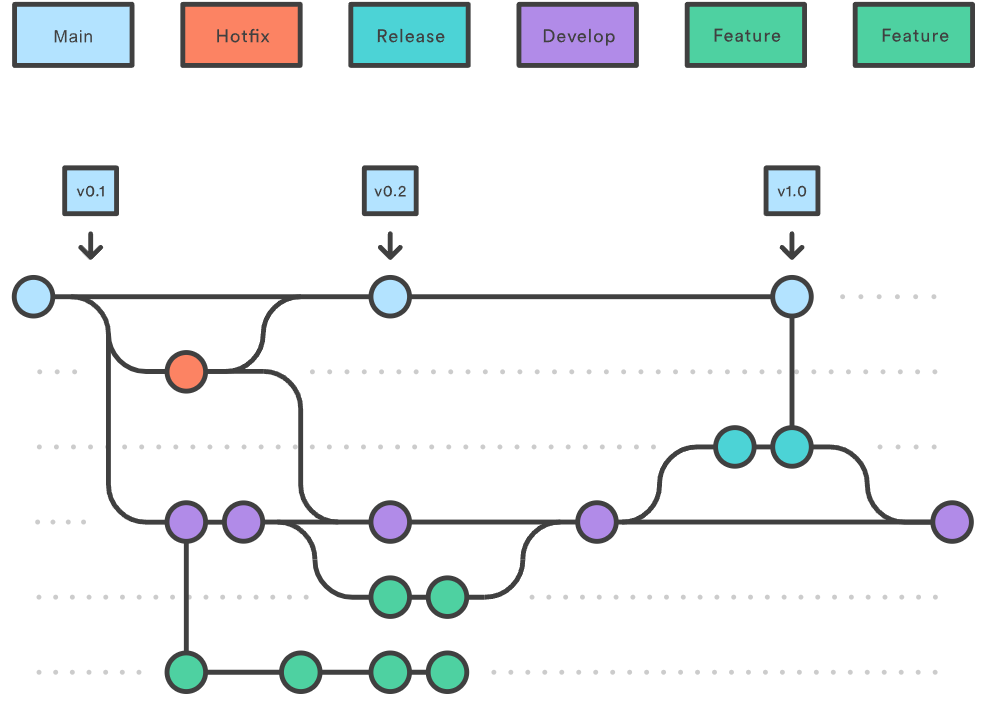

# Version Control Strategy #
For version control Git is used, together with Bitbucket remote repository.

## BRANCHING MODEL ##
Branching model used is based on Atlassian described [gitflow workflow](https://www.atlassian.com/git/tutorials/comparing-workflows/gitflow-workflow). The Release branch is not used for initial workflow simplicity.

## COMMIT MESSAGES ##
Commit messages must be written in English and be descriptive of the changes made. The message must be written as short as possible. The first letter must be capitalized.

## PULL REQUEST NAMING STRATEGY
The PR title must include what type of pull request it is with a brief explanation about what it is.
The types are following: Feature, Bugfix, Refactor, Documentation, Test, etc.

# PULL REQUEST REVIEW STRATEGY
At least one team member reviews the PR and approves or declines & comments the reason for it.
