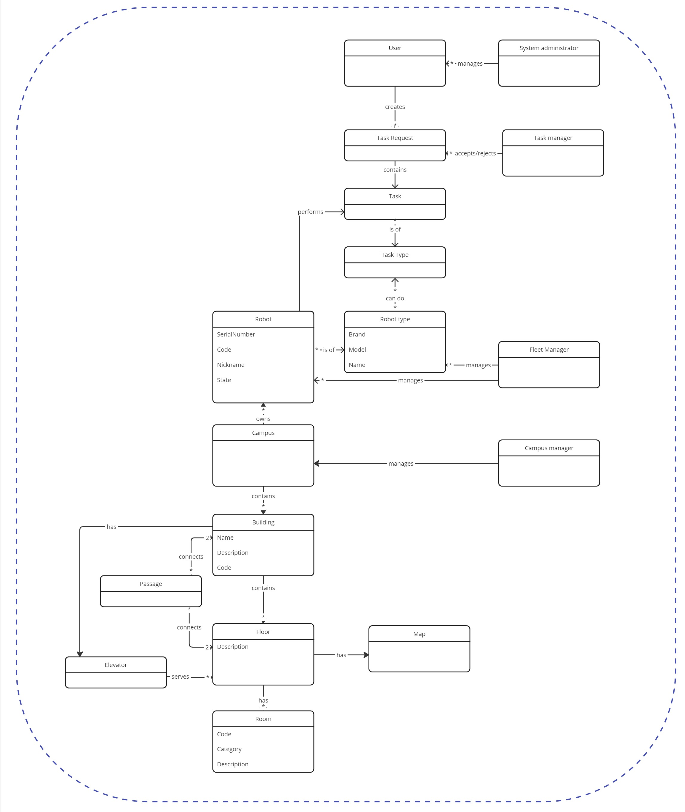
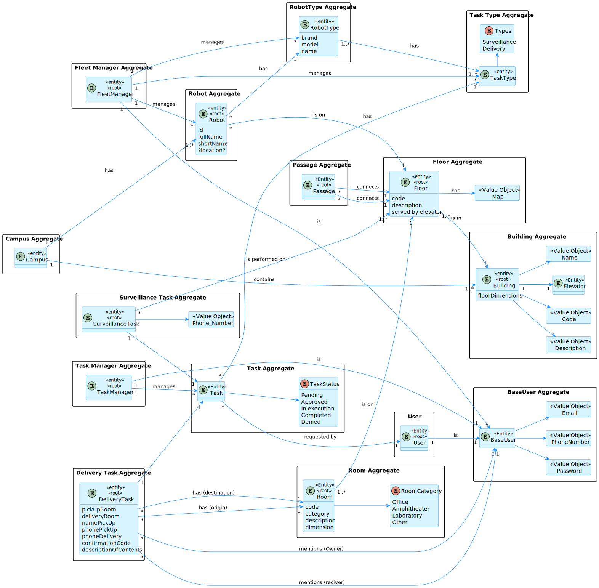
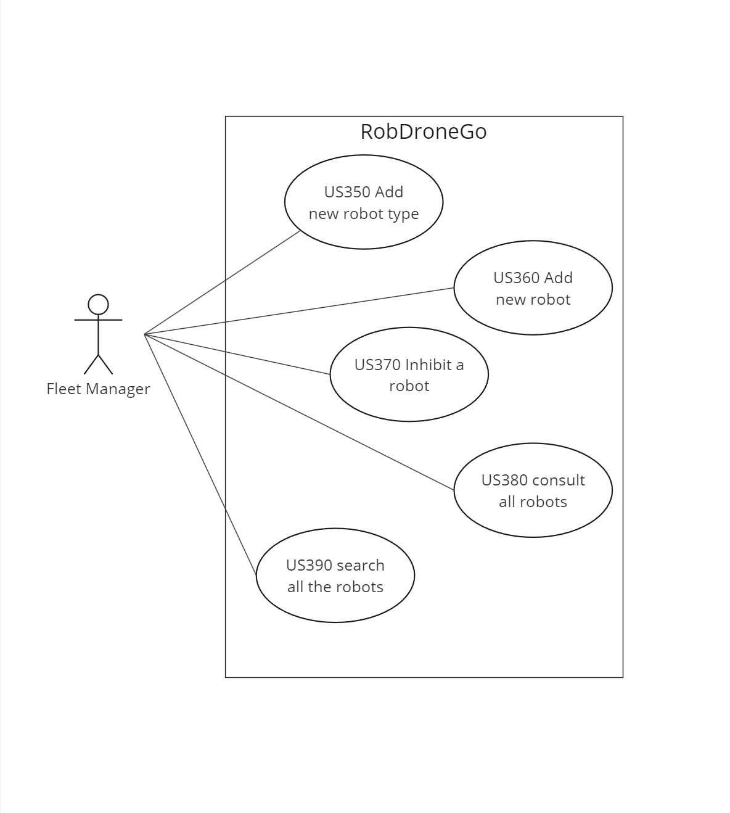

## Contents
- [Introduction](#introduction)
- [Business Concepts](#business-concepts)
- [Domain Design](#domain-design)
- [Logical Views](#logical-views)
    - [Logical View Lv1](#logical-view-lv1)
    - [Logical View Lv2](#logical-view-lv2)
    - [Logical View Lv3](#logical-view-lv3)
- [Process Views](#process-views)
    - [User Stories](#user-stories)
- [Deployment View](#deployment-view)
- [Scenario View (Use Cases)](#scenario-view-use-cases)

# Views

## Introduction
A combination of two architectural representation models will be adopted: C4 and 4+1.

The 4+1 View Model [[Krutchen-1995]](References.md#Kruchten-1995) proposes the description of the system through complementary views, allowing for separate analysis of the requirements of various software stakeholders, such as users, system administrators, project managers, architects, and programmers. The views are thus defined as follows:

- Logical View: related to aspects of the software aimed at meeting business challenges;
- Process View: related to the flow of processes or interactions in the system;
- Development View: related to the organization of software in its development environment;
- Physical View: related to the mapping of various software components to hardware, i.e., where the software is executed;
- Scenario View: related to associating business processes with actors capable of triggering them.

The C4 Model [[Brown-2020]](References.md#Brown-2020)[[C4-2020]](References.md#C4-2020) advocates describing software through four levels of abstraction: system, container, component, and code. Each level adopts finer granularity than the preceding level, thus providing more detail of a smaller part of the system. These levels can be comparable to maps, e.g., the system view corresponds to the globe, the container view corresponds to the map of each continent, the component view to the map of each country, and the code view to the road and neighborhood map of each city. Different levels allow telling different stories to distinct audiences.

The levels are defined as follows:
- Level 1: Description (framework) of the system as a whole;
- Level 2: Description of the system containers;
- Level 3: Description of the components of the containers;
- Level 4: Description of the code or smaller parts of the components (and as such, it will not be addressed in this DAS/SAD).

It can be said that these two models expand along distinct axes, with the C4 Model presenting the system with different levels of detail and the 4+1 View Model presenting the system from different perspectives. By combining the two models, it becomes possible to represent the system from various perspectives, each with several levels of detail.

For modeling/visually representing both what has been implemented and the considered ideas and alternatives, the Unified Modeling Language (UML) [[UML-2020]](References.md#UML-2020) [[UMLDiagrams-2020]](References.md#UMLDiagrams-2020) is used.

## Business Concepts

## Domain Design

### Logical View Lv1

### Logical View Lv2

### Logical View Lv3
.svg)

## Process Views

Proccess view is diagrams are described for each user story. Each user story is described in its own section.

* [ID150 - Create building](./US/ID-150/README.md)
* [ID160 - Edit building](./US/ID-160/README.md)
* [ID170 - List all buildings](./US/ID-170/README.md)
* [ID180 - List buildings with min and max floors](./US/ID-180/README.md)
* [ID190 - Create building floor](./US/ID-190/README.md)
* [ID200 - Edit building floor information](./US/ID-200/README.md)
* [ID210 - List all floors in a building](./US/ID-210/README.md)
* [ID220 - List building floors with passage to other buildings](./US/ID-220/README.md)
* [ID230 - Upload floor map](./US/ID-230/README.md)
* [ID240 - Create passage between buildings](./US/ID-240/README.md)
* [ID250 - Edit passage between buildings](./US/ID-250/README.md)
* [ID260 - List passages between 2 buildings](./US/ID-260/README.md)
* [ID270 - Create an elevator in a building](./US/ID-270/README.md)
* [ID280 - Edit elevator in building](./US/ID-280/README.md)
* [ID290 - List elevators in building](./US/ID-290/README.md)
* [ID300 - List building floors served by elevator](./US/ID-300/README.md)
* [ID310 - Create building floor room](./US/ID-310/README.md)
* [ID350 - Add new type of robot](./US/ID-350/README.md)
* [ID360 - Add new robot to the fleet](./US/ID-360/README.md)
* [ID370 - Inhibit a robot](./US/ID-370/README.md)
* [ID380 - Consult all robots in fleet](./US/ID-380/README.md)
* [ID390 - Search robots by designation or task](./US/ID-390/README.md)

### Deployment View

## Scenario View (Use Cases)
