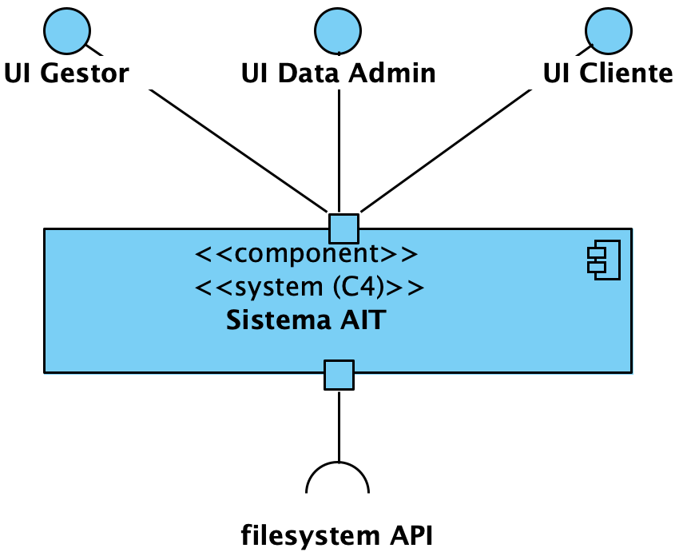
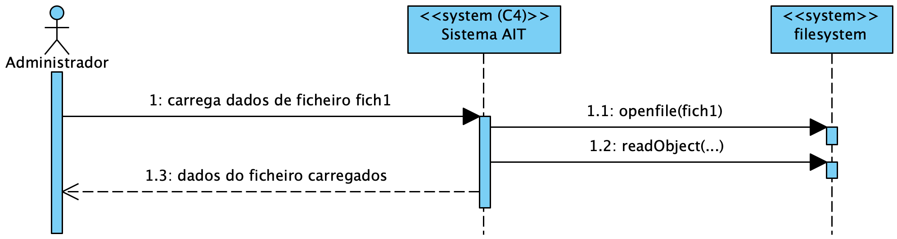
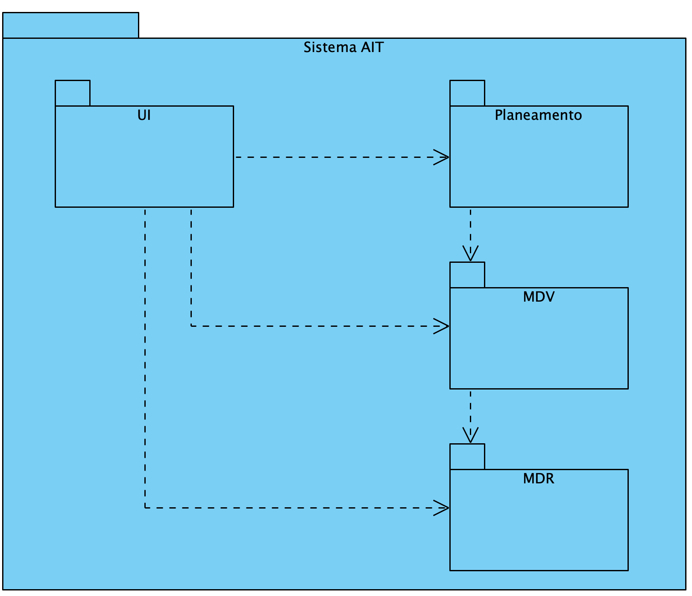
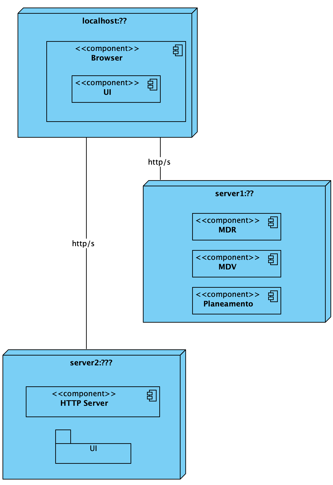
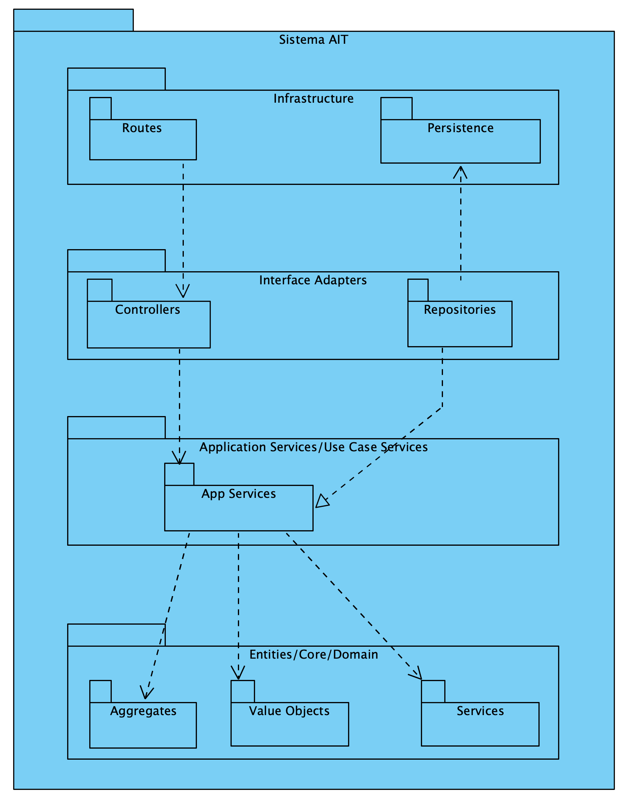
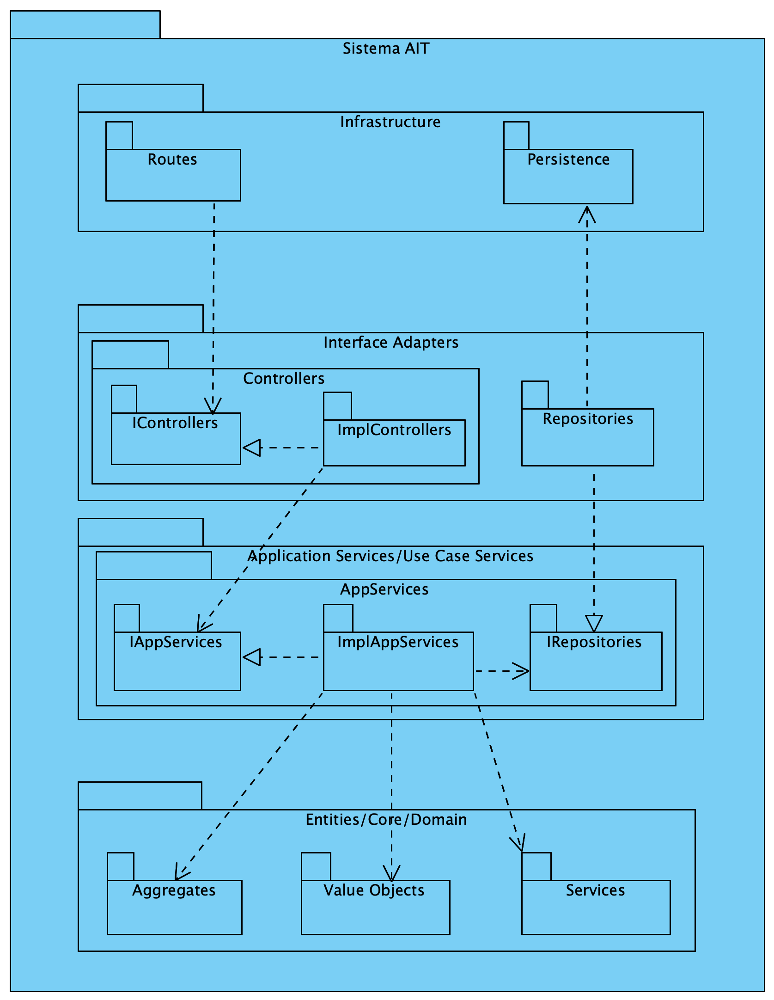

## Contents
- [Views](#views)
    - [Introduction](#introduction)
    - [Level 1](#level-1)
        - [Logical View](#logical-view)
        - [Process View](#process-view)
            - [SSD US1](#ssd-us1)
            - [SSD US2](#ssd-us2)
            - [(other architecturally relevant SSDs)](#other-architecturally-relevant-ssds)
    - [Level 2](#level-2)
        - [Logical View](#logical-view-1)
        - [Process View](#process-view-1)
            - [SSD US13 (Why this US?)](#ssd-us13-why-this-us)
            - [(other architecturally relevant SSDs)](#other-architecturally-relevant-ssds-1)
        - [Implementation View](#implementation-view)
        - [Physical View](#physical-view)
    - [Level 3 (MDR)](#level-3-mdr)
        - [Logical View](#logical-view-2)
        - [Process View](#process-view-2)
            - [SD US01](#sd-us01)
            - [(other architecturally relevant SSDs)](#other-architecturally-relevant-ssds-2)
        - [Implementation View](#implementation-view-1)
        - [Physical View](#physical-view-1)
    - [Level 3 (UI)](#level-3-ui)
        - [Logical View](#logical-view-3)
        - [Process View](#process-view-3)
        - [Implementation View](#implementation-view-2)
        - [Physical View](#physical-view-2)
    - [Level 3 (MDV)](#level-3-mdv)
        - [Logical View](#logical-view-4)
        - [Process View](#process-view-4)
        - [Implementation View](#implementation-view-3)
        - [Physical View](#physical-view-3)
    - [Level 3 (Planning)](#level-3-planning)
        - [Logical View](#logical-view-5)
        - [Process View](#process-view-5)
        - [Implementation View](#implementation-view-4)
        - [Physical View](#physical-view-4)

# Views

## Introduction
A combination of two architectural representation models will be adopted: C4 and 4+1.

The 4+1 View Model [[Krutchen-1995]](References.md#Kruchten-1995) proposes the description of the system through complementary views, allowing for separate analysis of the requirements of various software stakeholders, such as users, system administrators, project managers, architects, and programmers. The views are thus defined as follows:

- Logical View: related to aspects of the software aimed at meeting business challenges;
- Process View: related to the flow of processes or interactions in the system;
- Development View: related to the organization of software in its development environment;
- Physical View: related to the mapping of various software components to hardware, i.e., where the software is executed;
- Scenario View: related to associating business processes with actors capable of triggering them.

The C4 Model [[Brown-2020]](References.md#Brown-2020)[[C4-2020]](References.md#C4-2020) advocates describing software through four levels of abstraction: system, container, component, and code. Each level adopts finer granularity than the preceding level, thus providing more detail of a smaller part of the system. These levels can be comparable to maps, e.g., the system view corresponds to the globe, the container view corresponds to the map of each continent, the component view to the map of each country, and the code view to the road and neighborhood map of each city. Different levels allow telling different stories to distinct audiences.

The levels are defined as follows:
- Level 1: Description (framework) of the system as a whole;
- Level 2: Description of the system containers;
- Level 3: Description of the components of the containers;
- Level 4: Description of the code or smaller parts of the components (and as such, it will not be addressed in this DAS/SAD).

It can be said that these two models expand along distinct axes, with the C4 Model presenting the system with different levels of detail and the 4+1 View Model presenting the system from different perspectives. By combining the two models, it becomes possible to represent the system from various perspectives, each with several levels of detail.

For modeling/visually representing both what has been implemented and the considered ideas and alternatives, the Unified Modeling Language (UML) [[UML-2020]](References.md#UML-2020) [[UMLDiagrams-2020]](References.md#UMLDiagrams-2020) is used.

## Level 1
### Logical View

### Process View
#### SSD US1

#### SSD US2

#### (other architecturally relevant SSDs)
[...]

## Level 2
### Logical View

### Process View

#### SSD US13 (Why this US?)
TBD

#### (other architecturally relevant SSDs)
[...]

## Level 2
### Logical View

### Process View

#### SSD US13 (Why this US?)
TBD

#### (other architecturally relevant SSDs)
[...]

### Implementation View

### Physical View

A very simplified proposal. 

In fact, non-functional requirements ["Physical Contraints"](Background.md#Physical_Constraints) must be taken into consideration.

## Level 3 (MDR)
### Logical View
Alternative based on an architecture of superimposed layers:

Alternative based on a concentric layer architecture (Onion):

The Onion alternative will be adopted.

### Process View

#### SD US01
TBD

#### (other architecturally relevant SSDs)
[...]

### Implementation View

Some more details (if there were more than 4 levels, it could be considered level 4):

### Physical View

For now, there is no need to be represented.

## Level 3 (UI)
### Logical View
TBD

### Process View
TBD

### Implementation View
TBD

### Physical View
TBD

## Level 3 (MDV)
### Logical View
TBD

### Process View
TBD

### Implementation View
TBD

### Physical View
TBD

## Level 3 (Planning)
### Logical View
TBD

### Process View
TBD

### Implementation View
TBD

### Physical View
TBD
