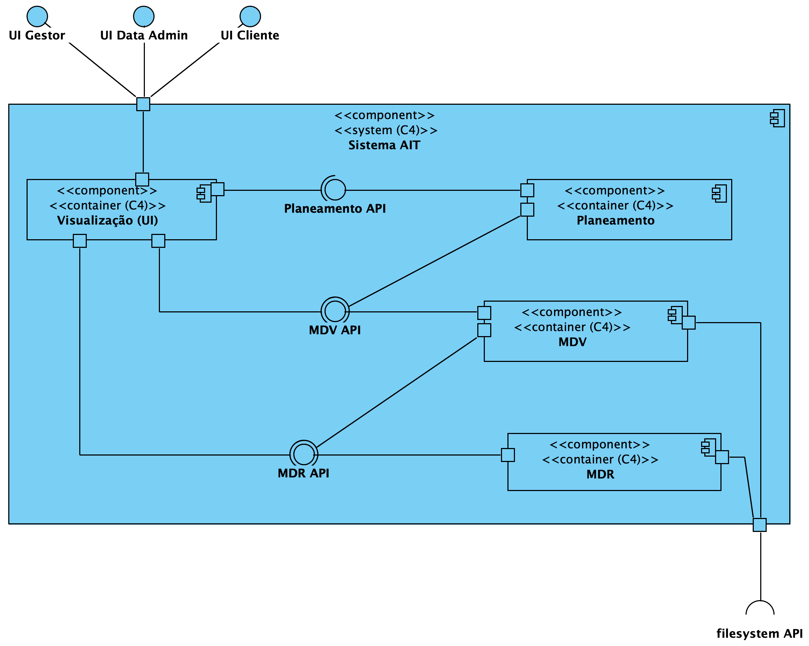
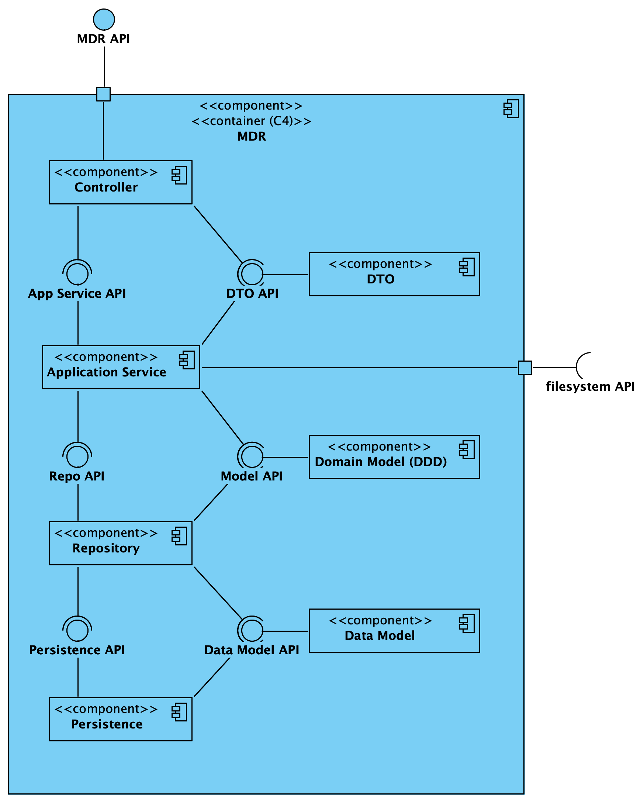
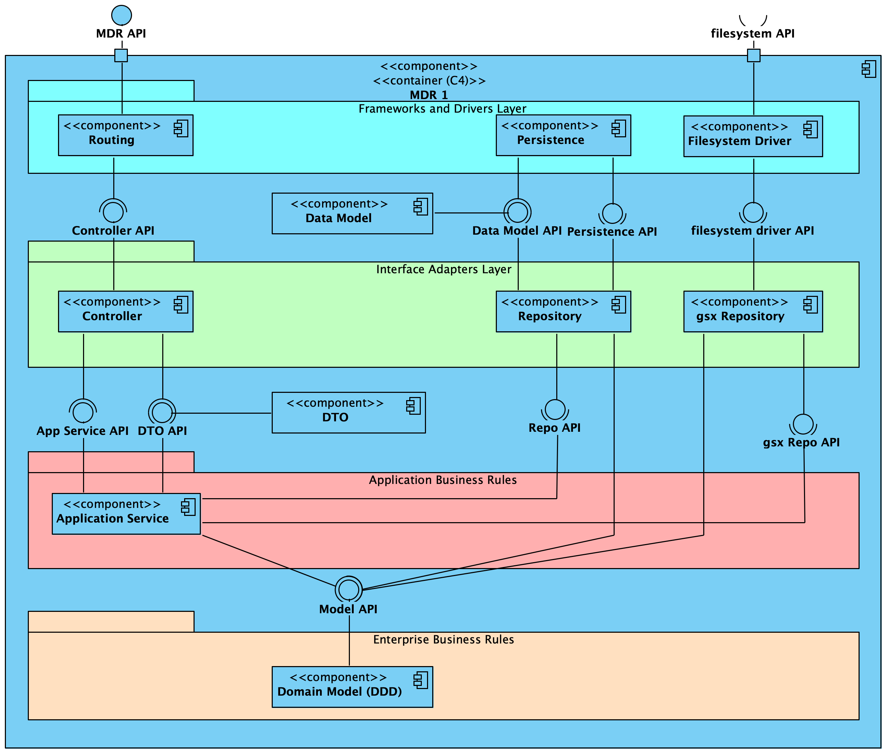

	## Contents
- [Views](#views)
	- [Introduction](#introduction)
	- [Nível 1](#nível-1)
		- [Vista Lógica](#vista-lógica)
		- [Vista de Processos](#vista-de-processos)
			- [SSD US1](#ssd-us1)
			- [SSD US2](#ssd-us2)
			- [(outros SSD arquiteturalmente relevantes)](#outros-ssd-arquiteturalmente-relevantes)
	- [Nível 2](#nível-2)
		- [Vista Lógica](#vista-lógica-1)
		- [Vista de Processos](#vista-de-processos-1)
			- [SSD US13 (Porquê esta US?)](#ssd-us13-porquê-esta-us)
			- [(outros SSD arquiteturalmente relevantes)](#outros-ssd-arquiteturalmente-relevantes-1)
		- [Vista de Implementação](#vista-de-implementação)
		- [Vista Física](#vista-física)
	- [Nível 3 (MDR)](#nível-3-mdr)
		- [Vista Lógica](#vista-lógica-2)
		- [Vista de Processos](#vista-de-processos-2)
			- [SD US01](#sd-us01)
			- [(outros SSD arquiteturalmente relevantes)](#outros-ssd-arquiteturalmente-relevantes-2)
		- [Vista de Implementação](#vista-de-implementação-1)
		- [Vista Física](#vista-física-1)
	- [Nível 3 (UI)](#nível-3-ui)
		- [Vista Lógica](#vista-lógica-3)
		- [Vista de Processos](#vista-de-processos-3)
		- [Vista de Implementação](#vista-de-implementação-2)
		- [Vista Física](#vista-física-2)
	- [Nível 3 (MDV)](#nível-3-mdv)
		- [Vista Lógica](#vista-lógica-4)
		- [Vista de Processos](#vista-de-processos-4)
		- [Vista de Implementação](#vista-de-implementação-3)
		- [Vista Física](#vista-física-3)
	- [Nível 3 (Planeamento)](#nível-3-planeamento)
		- [Vista Lógica](#vista-lógica-5)
		- [Vista de Processos](#vista-de-processos-5)
		- [Vista de Implementação](#vista-de-implementação-4)
		- [Vista Física](#vista-física-4)

# Views

## Introduction
Será adotada a combinação de dois modelos de representação arquitetural: C4 e 4+1.

O Modelo de Vistas 4+1 [[Krutchen-1995]](References.md#Kruchten-1995) propõe a descrição do sistema através de vistas complementares permitindo assim analisar separadamente os requisitos dos vários stakeholders do software, tais como utilizadores, administradores de sistemas, project managers, arquitetos e programadores. As vistas são deste modo definidas da seguinte forma:

- Vista lógica: relativa aos aspetos do software visando responder aos desafios do negócio;
- Vista de processos: relativa ao fluxo de processos ou interações no sistema;
- Vista de desenvolvimento: relativa à organização do software no seu ambiente de desenvolvimento;
- Vista física: relativa ao mapeamento dos vários componentes do software em hardware, i.e. onde é executado o software;
- Vista de cenários: relativa à associação de processos de negócio com atores capazes de os espoletar.

O Modelo C4 [[Brown-2020]](References.md#Brown-2020)[[C4-2020]](References.md#C4-2020) defende a descrição do software através de quatro níveis de abstração: sistema, contentor, componente e código. Cada nível adota uma granularidade mais fina que o nível que o antecede, dando assim acesso a mais detalhe de uma parte mais pequena do sistema. Estes níveis podem ser equiparáveis a mapas, e.g. a vista de sistema corresponde ao globo, a vista de contentor corresponde ao mapa de cada continente, a vista de componentes ao mapa de cada país e a vista de código ao mapa de estradas e bairros de cada cidade.
Diferentes níveis permitem contar histórias diferentes a audiências distintas.

Os níveis encontram-se definidos da seguinte forma:
- Nível 1: Descrição (enquadramento) do sistema como um todo;
- Nível 2: Descrição de contentores do sistema;
- Nível 3: Descrição de componentes dos contentores;
- Nível 4: Descrição do código ou partes mais pequenas dos componentes (e como tal, não será abordado neste DAS/SAD).

Pode-se dizer que estes dois modelos se expandem ao longo de eixos distintos, sendo que o Modelo C4 apresenta o sistema com diferentes níveis de detalhe e o Modelo de Vista 4+1 apresenta o sistema de diferentes perspetivas. Ao combinar os dois modelos torna-se possível representar o sistema de diversas perspetivas, cada uma com vários níveis de detalhe.

Para modelar/representar visualmente, tanto o que foi implementado como as ideias e alternativas consideradas, recorre-se à Unified Modeling Language (UML) [[UML-2020]](References.md#UML-2020) [[UMLDiagrams-2020]](References.md#UMLDiagrams-2020).

## Nível 1
### Vista Lógica

### Vista de Processos
#### SSD US1

#### SSD US2

#### (outros SSD arquiteturalmente relevantes)
[...]

## Nível 2
### Vista Lógica

### Vista de Processos

#### SSD US13 (Porquê esta US?)
TBD

#### (outros SSD arquiteturalmente relevantes)
[...]

### Vista de Implementação

### Vista Física

Uma proposta muito simplificada. 

De facto, deve-se ter em consideração os requisitos não funcionais ["Physical Contraints"](Background.md#Physical_Constraints).

## Nível 3 (MDR)
### Vista Lógica
Alternativa baseada numa arquitetura por camadas sobrepostas:

Alternativa baseada numa arquitetura por camadas concêntricas (Onion):

A alternativa Onion será a adotada.

### Vista de Processos

#### SD US01
TBD

#### (outros SSD arquiteturalmente relevantes)
[...]

### Vista de Implementação

Alguns detalhes mais (se existissem pais do que 4 níveis, podia ser considerado nível 4):

### Vista Física

Por agora, não existe necessidade de ser representada.

## Nível 3 (UI)
### Vista Lógica
TBD

### Vista de Processos
TBD

### Vista de Implementação
TBD

### Vista Física
TBD

## Nível 3 (MDV)
### Vista Lógica
TBD

### Vista de Processos
TBD

### Vista de Implementação
TBD

### Vista Física
TBD

## Nível 3 (Planeamento)
### Vista Lógica
TBD

### Vista de Processos
TBD

### Vista de Implementação
TBD

### Vista Física
TBD